# IPS Entity Relationship Diagram

## Mermaid ERD

```mermaid
erDiagram
    users ||--o{ user_role : has
    roles ||--o{ user_role : assigned
    roles ||--o{ role_permission : has
    permissions ||--o{ role_permission : granted

    users ||--o{ service_requests : submits
    users ||--o| staff_profiles : has
    service_requests ||--|{ service_request_items : contains
    services ||--o{ service_request_items : requested
    service_categories ||--o{ services : groups
    service_requests ||--o{ service_request_documents : has
    service_requests ||--o{ service_request_status_history : tracks
    service_requests ||--o{ service_request_messages : has
    service_requests ||--o| quotations : receives
    quotations ||--|{ quotation_items : contains
    service_requests ||--o{ payments : has
    service_requests ||--o{ staff_assignments : requires
    staff_profiles ||--o{ staff_assignments : assigned
    staff_profiles ||--o{ staff_documents : has
    staff_profiles ||--o{ staff_availability : schedules

    service_requests ||--o| projects : spawns
    projects ||--|{ tasks : contains
    tasks ||--o{ task_comments : has
    users ||--o{ tasks : assigned

    users ||--o{ announcements : creates
    announcements ||--|{ announcement_recipients : targets
    announcements ||--o{ announcement_attachments : has

    service_requests ||--o{ calendar_events : schedules
    staff_profiles ||--o{ calendar_events : blocks
    users ||--o{ blog_posts : authors
    users ||--o{ activity_logs : performs
    users ||--o{ whatsapp_notifications : receives

    users {
        bigint id PK
        char uuid UK
        string phone UK
        string email UK
        string name
    }

    roles {
        bigint id PK
        string name UK
        string display_name
    }

    services {
        bigint id PK
        bigint category_id FK
        string name
        decimal base_price
        boolean is_active
    }

    service_requests {
        bigint id PK
        string reference_number UK
        bigint user_id FK
        enum status
        string client_phone
        string tracking_token UK
    }

    quotations {
        bigint id PK
        bigint service_request_id FK
        decimal total
        enum status
    }

    payments {
        bigint id PK
        bigint service_request_id FK
        enum method
        enum status
        decimal amount
    }

    staff_profiles {
        bigint id PK
        bigint user_id FK
        enum staff_type
        decimal rating_avg
    }

    projects {
        bigint id PK
        bigint service_request_id FK
        enum status
    }

    tasks {
        bigint id PK
        bigint project_id FK
        bigint assigned_to FK
        enum status
        enum priority
    }

    announcements {
        bigint id PK
        enum target_group
        json channels
        enum status
    }
```



## Module Relationship Map

```
┌─────────────────────────────────────────────────────────────────┐
│                        PUBLIC WEBSITE                            │
│  Home │ About │ Services │ Gallery │ Blog │ FAQ │ Contact       │
└──────────────────────────┬──────────────────────────────────────┘
                           │ reads
                           ▼
┌─────────────────────────────────────────────────────────────────┐
│                     SERVICES MODULE                              │
│  service_categories ──► services (dynamic, auto-display)         │
└──────────────────────────┬──────────────────────────────────────┘
                           │ selected in
                           ▼
┌─────────────────────────────────────────────────────────────────┐
│                   SERVICE REQUEST WORKFLOW                       │
│  service_requests ──► items │ documents │ signature │ PDF       │
│         │                                                        │
│         ├──► WhatsApp + Email notifications                      │
│         ├──► Client Portal (track, pay, communicate)             │
│         └──► Admin Review (per-service approve/reject)           │
└──────────┬──────────────────┬──────────────────┬────────────────┘
           │                  │                  │
           ▼                  ▼                  ▼
┌──────────────────┐ ┌──────────────────┐ ┌──────────────────────┐
│   QUOTATIONS     │ │    PAYMENTS      │ │  STAFF ASSIGNMENTS   │
│  items + PDF     │ │ MTN/Airtel/      │ │  protocol, drivers,  │
│  tax/discount    │ │ Flutterwave      │ │  translators, etc.   │
└────────┬─────────┘ └──────────────────┘ └──────────┬───────────┘
         │                                              │
         └──────────────────┬───────────────────────────┘
                            ▼
┌─────────────────────────────────────────────────────────────────┐
│              OPERATIONS LAYER                                    │
│  Projects ──► Tasks (Kanban) │ Calendar │ Announcements          │
└─────────────────────────────────────────────────────────────────┘
                            │
                            ▼
┌─────────────────────────────────────────────────────────────────┐
│              GOVERNANCE LAYER                                    │
│  Roles & Permissions │ Activity Logs │ 2FA │ Audit Trails       │
└─────────────────────────────────────────────────────────────────┘
```

## Cardinality Summary

| Relationship | Cardinality |
|-------------|-------------|
| User → Service Request | 1:N |
| Service Request → Service Items | 1:N |
| Service Request → Quotation | 1:0..1 (active) |
| Service Request → Payments | 1:N |
| Service Request → Staff Assignments | 1:N |
| Service Request → Project | 1:0..1 |
| Project → Tasks | 1:N |
| Task → Subtasks | 1:N (self-ref) |
| Announcement → Recipients | 1:N |
| Staff Profile → Assignments | 1:N |
| Role → Permissions | N:M |

## Reference Number Generation

```
IPS-{YEAR}-{SEQ:6}        → Service Requests   (IPS-2026-000001)
IPS-Q-{YEAR}-{SEQ:6}      → Quotations         (IPS-Q-2026-000001)
IPS-P-{YEAR}-{SEQ:6}      → Payments           (IPS-P-2026-000001)
IPS/ANN-{SEQ:6}           → Announcements      (IPS/ANN-000001)
```

Stored in `reference_counters` table with row-level locking to prevent duplicates.
